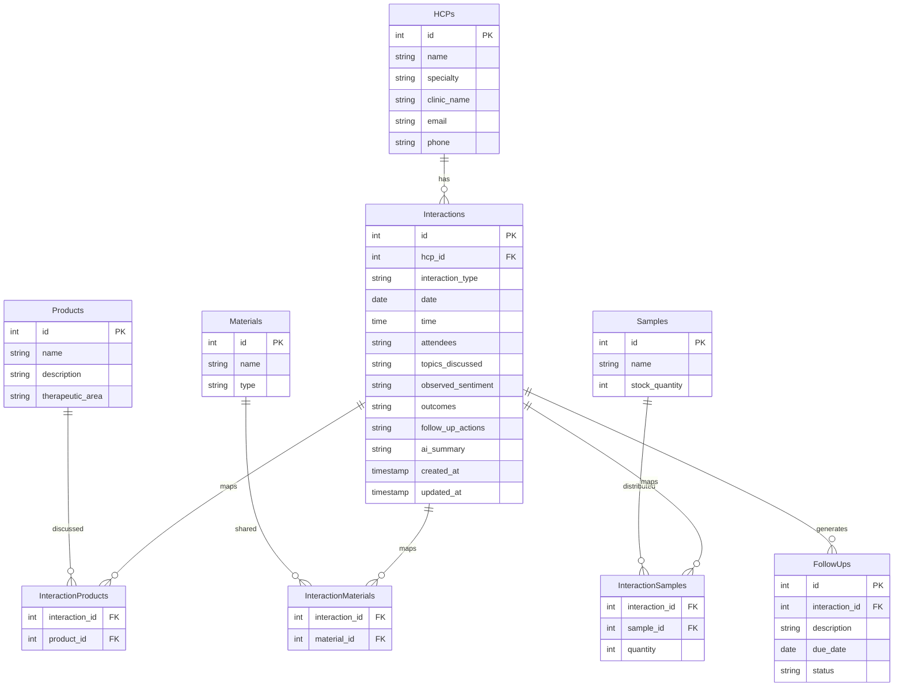
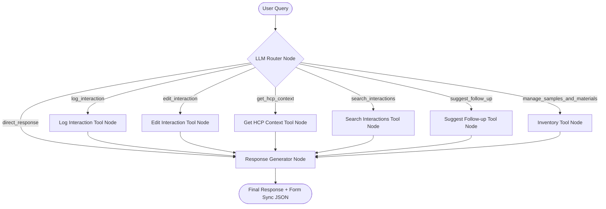

# Implementation Plan - AI-First CRM HCP Log Interaction Module

This document outlines the architecture, database schema, agent design, and file-by-file plan for building the AI-First CRM HCP Log Interaction Screen.

## 1. Goal Description
The objective is to build a high-fidelity, production-grade HCP Interaction module featuring:
1. A **Structured Interaction Form** (left side) that allows manual entries and edits.
2. An **AI Assistant Chat Interface** (right side) running on **LangGraph + Groq** that processes natural language notes (e.g., *"Met Dr. Sharma today. Discussed Product X..."*) to extract structured details, invoke DB tools, persist data, and visually update the form.
3. A shared state (via **Redux Toolkit**) connecting the form and the AI assistant, allowing conversational edits (e.g., *"Actually, change the sentiment to neutral"*).
4. Concrete tools in the backend representing real CRM workflows (logging, editing, context retrieval, search, follow-up suggestions, inventory checks).

---

## 2. Technical Stack
* **Frontend**: React + Vite + TypeScript, Redux Toolkit, Axios, Lucide React (for icons)
* **Styling**: Vanilla CSS, Google Inter Font, Responsive two-column layout
* **Backend**: Python 3.12+ with FastAPI, SQLAlchemy ORM
* **Agent Framework**: LangGraph, LangChain Core
* **LLM Integration**: Groq API (Default model: `llama-3.3-70b-versatile` due to `gemma2-9b-it` deprecation, configurable via `.env`)
* **Database**: PostgreSQL (Service `postgresql-x64-18` currently running on port `5432` on user's machine)

---

## 3. Repository Structure
```text
aivoa/
├── README.md
├── IMPLEMENTATION_PLAN.md
├── backend/
│   ├── .env.example
│   ├── .env
│   ├── requirements.txt
│   ├── seed.py
│   └── app/
│       ├── __init__.py
│       ├── main.py
│       ├── config.py
│       ├── database.py
│       ├── models.py
│       ├── schemas.py
│       ├── crud.py
│       └── agent/
│           ├── __init__.py
│           ├── graph.py
│           ├── tools.py
│           └── prompts.py
└── frontend/
    ├── package.json
    ├── vite.config.ts
    ├── tsconfig.json
    ├── index.html
    ├── src/
    │   ├── main.tsx
    │   ├── App.tsx
    │   ├── index.css
    │   ├── types.ts
    │   ├── api.ts
    │   ├── store/
    │   │   ├── index.ts
    │   │   └── interactionSlice.ts
    │   └── components/
    │       ├── InteractionForm.tsx
    │       ├── ChatPanel.tsx
    │       ├── HCPContextPanel.tsx
    │       └── InventoryPanel.tsx
```

---

## 4. Database Schema
We will create 9 tables in PostgreSQL.



### Seed Data
* **HCPs**:
  1. `Dr. Rajesh Sharma` (Cardiology, Metro Heart Institute)
  2. `Dr. Sarah Jenkins` (Oncology, St. Jude Medical Center)
  3. `Dr. Amit Patel` (Endocrinology, Apex Diabetes Care)
* **Products**:
  1. `CardioFlow 10mg` (Cardiovascular, Beta-blocker)
  2. `OncoBoost 50mg` (Oncology, Targeted therapy)
  3. `GlycaStop 5mg` (Endocrinology, Oral hypoglycemic)
* **Materials**:
  1. `Cardiology Patient Guide` (Brochure)
  2. `OncoBoost Phase III Trial Report` (PDF Document)
  3. `GlycaStop Prescribing Information` (PDF Document)
* **Samples**:
  1. `CardioFlow 10mg Sample Pack` (Stock: 100)
  2. `OncoBoost 50mg Sample Pack` (Stock: 50)
  3. `GlycaStop 5mg Starter Kit` (Stock: 200)

---

## 5. LangGraph Architecture
The agent will use a deterministic, bounded workflow designed for reliability during the hiring demo.



### Graph State Schema (`AgentState`)
```python
from typing import Annotated, Sequence, TypedDict, Optional
from langchain_core.messages import BaseMessage
from langgraph.graph.message import add_messages

class AgentState(TypedDict):
    messages: Annotated[Sequence[BaseMessage], add_messages]
    current_interaction_id: Optional[int]
    hcp_context: Optional[dict]
    form_data: Optional[dict]       # Populated by log/edit tools for frontend form sync
    tool_outputs: list[dict]        # Traced execution log shown to the evaluator in the UI
```

---

## 6. Concrete LangGraph Tools
We will implement 6 tools. Every tool accesses the DB via a SQLAlchemy session.

| Tool Name | Input Arguments | Output Description | DB Operations | Trigger Intent | Demo Visual |
| :--- | :--- | :--- | :--- | :--- | :--- |
| `log_interaction` | `hcp_name`, `interaction_type`, `date`, `time`, `topics_discussed`, `observed_sentiment`, `attendees`, `outcomes`, `follow_up_actions`, `products`, `materials`, `samples` | Log success details, interaction ID, and resolved entities. | Match HCP, products, materials. Create interaction & join rows. Deduct samples. | Logging a new visit (e.g. *"Met Dr. Sharma today..."*) | Left-side form auto-fills completely. Inventory stock decreases. |
| `edit_interaction` | `interaction_id` (optional, falls back to active), `updates` (dictionary of fields) | Modified fields and status. | Update columns in `interactions` table. | Adjusting a logged visit (e.g. *"Change sentiment to neutral"*) | Form fields update instantly (e.g., radio button moves to Neutral). |
| `get_hcp_context` | `hcp_name` | HCP details, history of last 3 interactions, preferences, pending follow-ups. | Read HCP profile, interactions, and follow-ups. | Inquiring about an HCP (e.g. *"What is Dr. Sharma's info?"*) | Populates the HCP Context Panel with a summary card. |
| `search_interactions` | `query` (optional), `limit` | List of matching interactions with dates, topics, and sentiments. | Search text in topics, outcomes, follow-ups or filter by HCP. | Finding historical records (e.g. *"Search for positive meetings"*) | Renders a clickable interaction search result history list in chat. |
| `suggest_follow_up` | `interaction_id` (optional), `topics_discussed` | Generated tasks (e.g. Email drafts, calendar invites, meeting dates). | Optional read of current interaction to feed LLM context. | Requesting next steps (e.g. *"Give me follow-up tasks"*) | Displays actionable "+ Schedule follow-up" links below the form. |
| `manage_samples_and_materials` | `action` ("list_samples", "list_materials") | List of available items and current stock numbers. | Read samples and materials tables. | Checking items/inventory (e.g. *"What samples do I have?"*) | Shows a list of samples with updated counts in the Chat panel. |

---

## 7. API Routes
FastAPI will expose the following endpoints:
* `GET /api/metadata`: Returns list of HCPs, products, materials, and samples for autocomplete dropdowns.
* `GET /api/interactions`: Returns recent interactions.
* `POST /api/interactions`: Creates an interaction manually (via the left form's manual submit).
* `PUT /api/interactions/{id}`: Edits an interaction manually.
* `POST /api/chat`: The core endpoint. Accepts `{"message": str, "current_interaction_id": Optional[int]}`. Runs the LangGraph and returns:
  ```json
  {
    "response": "Conversational summary of what the agent did...",
    "current_interaction_id": 12,
    "form_data": { ... },
    "hcp_context": { ... },
    "tool_calls": [
      { "name": "log_interaction", "args": { ... }, "status": "success", "result": "..." }
    ]
  }
  ```

---

## 8. Frontend Interface Design
* **Layout**: Large split-pane layout.
  * **Left Pane (60%)**: Interactive form with fields (HCP Dropdown, Type Dropdown, Date, Time, Attendees, Topics Discussed, Materials Shared, Samples Distributed, Sentiment Radio Buttons, Outcomes, Follow-up Actions). At the bottom, a list of **AI Suggested Follow-ups**.
  * **Right Pane (40%)**: AI Assistant chat interface. Chat history bubble style, and at the bottom a fixed input with a microphone icon and a "Log" button.
* **Redux Synchronization**:
  * Action `setFormData` will populate the left form.
  * Action `addChatMessage` adds user, assistant, or tool messages.
  * Action `setActiveInteractionId` sets the currently active interaction ID.
* **Visual Tool Call Tracer**: In the chat stream, when a tool execution record is in the api response, a modern, technical badge appears (e.g., `⚙️ Executed tool: log_interaction` with an expandable/collapsible parameter list).

---

## 9. Implementation Phases & Timeline (Today)

### Phase 1: DB Setup and Seed
1. Install Python packages (`fastapi`, `uvicorn`, `sqlalchemy`, `psycopg2-binary`, `pydantic`, `langgraph`, `langchain-groq`, `python-dotenv`).
2. Implement database connection and schema models in `backend/app/models.py`.
3. Create `backend/seed.py` and run it to pre-populate the DB with realistic healthcare professional data.

### Phase 2: LangGraph & Tools
1. Implement the 6 tools inside `backend/app/agent/tools.py`.
2. Define the routing logic and graph nodes in `backend/app/agent/graph.py`.
3. Test the agent flow via a quick command-line test script.

### Phase 3: FastAPI Backend API
1. Implement REST routes for interactions, metadata, and the `/api/chat` route in `backend/app/main.py`.
2. Verify that `/api/chat` returns structured `form_data` updates alongside tool calls.

### Phase 4: Frontend Development
1. Create a React + Vite + TypeScript application in `frontend/`.
2. Install Redux Toolkit (`@reduxjs/toolkit`, `react-redux`).
3. Build the Redux slice `interactionSlice.ts` to manage form data, chat logs, active interaction, and lists.
4. Implement `index.css` with a high-fidelity dark-themed dashboard.
5. Create the components: `InteractionForm` (left panel), `ChatPanel` (right panel), and sub-widgets.

### Phase 5: Verification & Walkthrough
1. Connect frontend and backend.
2. Run manual verification scenarios (logging, editing, querying history, context updates).
3. Produce `walkthrough.md` documenting the exact test flows.

---

## 10. Video Demonstration Scenarios
To make the 10-15 minute submission video outstanding, we will design the app to support three clean scenarios:

* **Scenario 1: Conversational Log Interaction**
  * Representative inputs: *"Met Dr. Sarah Jenkins today. We discussed OncoBoost 50mg. She was highly positive but requested pricing. I shared the OncoBoost Phase III Trial Report and gave her 3 samples. Follow up in two weeks."*
  * **Result**: Chat executes `log_interaction`. The form updates, showing Dr. Sarah Jenkins, Positive sentiment, OncoBoost 50mg, OncoBoost Phase III Report, 3 samples, and the follow-up text.
* **Scenario 2: Conversational Modification**
  * Representative inputs: *"Actually change the sentiment to neutral and add 'Check competitor pricing' to follow-up."*
  * **Result**: Chat executes `edit_interaction` on the active interaction. The form's sentiment updates to Neutral, and the follow-up text updates.
* **Scenario 3: HCP Context & Inventory Check**
  * Representative inputs: *"Show me Dr. Sharma's profile and what CardioFlow sample inventory I have left."*
  * **Result**: Executing `get_hcp_context` and `manage_samples_and_materials`. Chat outputs details about Dr. Rajesh Sharma and shows that the sample stock is now 98 (from 100).

---

## 11. Environment Variables & Risks
### Environment Variables (`backend/.env`)
```bash
DATABASE_URL=postgresql://postgres:<password>@localhost:5432/aivoa
GROQ_API_KEY=gsk_...
GROQ_MODEL=llama-3.3-70b-versatile
```

### Risks and Mitigations
* **Risk: Deprecation of `gemma2-9b-it`**: Since Groq officially removed `gemma2-9b-it`, the app will fail if hardcoded.
  * *Mitigation*: We default to `llama-3.3-70b-versatile`, but make the model string fully configurable via the `.env` file so the evaluator can test different models.
* **Risk: Database Connection**: If PostgreSQL credentials are misconfigured, the backend won't start.
  * *Mitigation*: We will build clean database checking logs on backend startup and provide a simple fallback or script to configure the DB URL.
* **Risk: Speech/Audio Transcription**: The reference UI has a microphone icon.
  * *Mitigation*: Since a phone audio system or speech API requires complex setup, we will mock the transcription with a clean frontend modal or native Web Speech API (transcribing microphone to the input text box) so that it works out of the box in the browser without backend dependencies! This is highly impressive.
