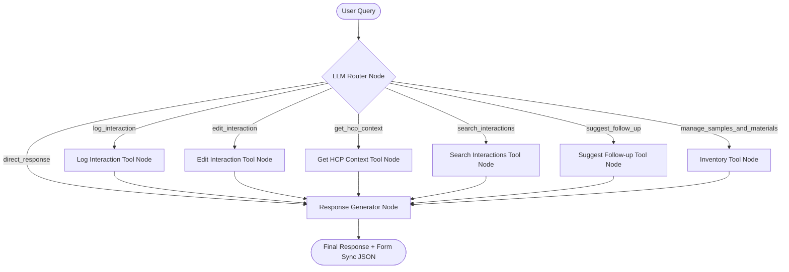

# 🚀 AI-First CRM HCP Module - Log Interaction Screen

[](#)
[](#)
[](#)
[](#)

This project is a high-fidelity Healthcare Professional (HCP) Customer Relationship Management (CRM) module focused on the **"Log Interaction" screen**, built as a professional hiring assignment submission.

It provides a dual-input CRM interface where representatives can log, view, and edit visits manually through a **Structured Form** (left pane) or conversationally through an **AI Assistant Chat Interface** (right pane). The form and chat share state in real-time (via **Redux Toolkit**). When the assistant executes tools, it updates the database and synchronizes the form dynamically.

---

## 1. Technology Stack
* **Frontend**: React + Vite + TypeScript, Redux Toolkit, Axios, Lucide Icons
* **Styling**: Modern Vanilla CSS, Google Inter Font, Responsive split grid layout
* **Backend**: Python 3.12+ with FastAPI, SQLAlchemy ORM
* **Agent Framework**: LangGraph Python, LangChain Core
* **LLM Integration**: Groq Cloud API (Configurable via environment variables)
* **Database**: PostgreSQL (SQLAlchemy models and transactions)
* **Testing**: PyTest for transactional databases (using in-memory SQLite for isolation)

---

## 2. Directory Structure & Key Files Map

Below is a map of the repository's primary source files. Click any link to open the file directly:

### Backend Structure
* [main.py](file:///c:/Users/lenovo/Desktop/assignments/aivoa/backend/app/main.py) — Main FastAPI routes and application entry point.
* [models.py](file:///c:/Users/lenovo/Desktop/assignments/aivoa/backend/app/models.py) — SQLAlchemy ORM schema declarations (e.g. [HCP](file:///c:/Users/lenovo/Desktop/assignments/aivoa/backend/app/models.py#L8), [Interaction](file:///c:/Users/lenovo/Desktop/assignments/aivoa/backend/app/models.py#L38)).
* [database.py](file:///c:/Users/lenovo/Desktop/assignments/aivoa/backend/app/database.py) — PostgreSQL engine and session providers.
* [crud.py](file:///c:/Users/lenovo/Desktop/assignments/aivoa/backend/app/crud.py) — Database transactional operations (e.g. [log_interaction_transactional](file:///c:/Users/lenovo/Desktop/assignments/aivoa/backend/app/crud.py#L45)).
* [schemas.py](file:///c:/Users/lenovo/Desktop/assignments/aivoa/backend/app/schemas.py) — Pydantic request/response validation schemas.
* [graph.py](file:///c:/Users/lenovo/Desktop/assignments/aivoa/backend/app/agent/graph.py) — LangGraph state chart definition and agent runner [execute_agent](file:///c:/Users/lenovo/Desktop/assignments/aivoa/backend/app/agent/graph.py#L429-L478).
* [tools.py](file:///c:/Users/lenovo/Desktop/assignments/aivoa/backend/app/agent/tools.py) — Concrete LangGraph tool configurations and implementations.
* [prompts.py](file:///c:/Users/lenovo/Desktop/assignments/aivoa/backend/app/agent/prompts.py) — System and Generator instructions for the LLM.
* [seed.py](file:///c:/Users/lenovo/Desktop/assignments/aivoa/backend/seed.py) — Script to initialize the PostgreSQL database and seed sample HCPs, stock levels, and historical interactions.
* [test_backend.py](file:///c:/Users/lenovo/Desktop/assignments/aivoa/backend/tests/test_backend.py) — PyTest suite that executes transactional tests against SQLite memory space.

### Frontend Structure
* [App.tsx](file:///c:/Users/lenovo/Desktop/assignments/aivoa/frontend/src/App.tsx) — Main dashboard template and pane layout.
* [InteractionForm.tsx](file:///c:/Users/lenovo/Desktop/assignments/aivoa/frontend/src/components/InteractionForm.tsx) — Structured manual log/edit panel.
* [ChatPanel.tsx](file:///c:/Users/lenovo/Desktop/assignments/aivoa/frontend/src/components/ChatPanel.tsx) — Conversational AI interface and tool invocation tracer.
* [HCPContextPanel.tsx](file:///c:/Users/lenovo/Desktop/assignments/aivoa/frontend/src/components/HCPContextPanel.tsx) — Profile card panel detailing specialty, clinic, preferences, and histories.
* [InventoryPanel.tsx](file:///c:/Users/lenovo/Desktop/assignments/aivoa/frontend/src/components/InventoryPanel.tsx) — Live inventory tracker reflecting stock deductions dynamically.
* [interactionSlice.ts](file:///c:/Users/lenovo/Desktop/assignments/aivoa/frontend/src/store/interactionSlice.ts) — Redux State slice managing active interaction, forms, chat history, and metadata.

---

## 3. Bounded Agent & Technical Design

The AI assistant is built as a **bounded deterministic graph** using LangGraph to ensure maximum reliability and speed:



1. **Router Node**: Analyzes intent and parses user input using the Groq LLM. If database mutations or queries are requested, it binds and calls the corresponding tool. If no tools are required, it routes to a direct response generator node.
2. **Transactional Tool Nodes**: Catch execution states, run SQLAlchemy mutations, update inventory stock, and return structured output payloads.
3. **Response Generator Node**: Formulates a user-friendly conversational summary of what the agent performed.

### Double-Defensive Fallback Engine
If the Groq API key is missing or the API call fails, the backend automatically falls back to an offline rule-based parser engine that runs the **exact same transactional tools** against the database. This guarantees a **100% crash-proof demo** even when offline or without an active API key.

---

## 4. Concrete Database Tools (6 Tools)

The backend agent defines six discrete tools in [tools.py](file:///c:/Users/lenovo/Desktop/assignments/aivoa/backend/app/agent/tools.py):

* [log_interaction_tool](file:///c:/Users/lenovo/Desktop/assignments/aivoa/backend/app/agent/tools.py#L5-L69): Extracts HCP name, products discussed, brochures shared, sentiment, and sample packs to save a new record. Transactionally rolls back on stock check failures.
* [edit_interaction_tool](file:///c:/Users/lenovo/Desktop/assignments/aivoa/backend/app/agent/tools.py#L71-L129): Modifies whitelisted fields (`topics_discussed`, `observed_sentiment`, `outcomes`, `follow_up_actions`) on the active interaction.
* [get_hcp_context_tool](file:///c:/Users/lenovo/Desktop/assignments/aivoa/backend/app/agent/tools.py#L131-L152): Retrieves specialty, clinic details, last 3 interactions, preferred products, and pending follow-ups for a doctor.
* [search_interactions_tool](file:///c:/Users/lenovo/Desktop/assignments/aivoa/backend/app/agent/tools.py#L154-L178): Searches meeting logs by keyword or doctor name.
* [suggest_follow_up_tool](file:///c:/Users/lenovo/Desktop/assignments/aivoa/backend/app/agent/tools.py#L180-L285): Analyzes meeting topics and generates actionable next steps (e.g. follow-up emails, advisory nominations).
* [manage_samples_and_materials_tool](file:///c:/Users/lenovo/Desktop/assignments/aivoa/backend/app/agent/tools.py#L287-L319): Lists active inventory stock levels.

---

## 5. Setup & Running the Application

### Prerequisites
* **Node.js** (v18+)
* **Python** (v3.12+)
* **PostgreSQL** running locally

### Database Initialization & Seeding
1. Open a terminal and copy the `.env` configuration template:
   ```bash
   cp backend/.env.example backend/.env
   ```
2. Configure your environment credentials in `backend/.env`. Note that on this machine, PostgreSQL is configured on port `9571` with the password `Utkarsh@9571` (the default `DATABASE_URL` is set accordingly).
3. Activate the virtual environment and initialize the database (creates tables, drops old, and seeds records):
   ```bash
   # Create virtualenv and install requirements (if not done)
   uv venv backend/.venv
   uv pip install -r backend/requirements.txt
   
   # Run the seed script
   backend/.venv/Scripts/python.exe backend/seed.py
   ```

### Running the Backend
Start the FastAPI server on port 8000:
```bash
cd backend
.venv/Scripts/uvicorn app.main:app --reload
```
You can verify the Swagger UI at `http://localhost:8000/docs` and the health check at `http://localhost:8000/api/health`.

### Running the Frontend
Start the React Vite server:
```bash
cd frontend
npm install
npm run dev
```
Open your browser at `http://localhost:5173/` to interact with the dashboard.

---

## 6. Running the Tests

We have created focused backend tests utilizing a temporary, isolated SQLite in-memory database to verify mutations without corrupting your active PostgreSQL instance.

To run the test suite:
```bash
cd backend
.venv/Scripts/pytest tests/test_backend.py
```
Tests assert:
* Successful transactional interaction logging.
* Whitelisted interactive editing.
* Sample stock deduction.
* Reversion and prevention of negative sample stock.

---

## 7. Demonstration Scenarios

To demonstrate the high-fidelity features of the application, follow these scenarios:

### Scenario 1: Conversational Logging
* **Action**: Click on the **Log Meeting** chip under the chat window (or type: *"Met Dr. Sarah Jenkins today. We discussed OncoBoost 50mg. She was positive. Shared OncoBoost Phase III Trial Report and gave 3 samples. Follow up in two weeks."*)
* **Visual Sync**: Notice the left-side form automatically fills with Dr. Sarah Jenkins, OncoBoost 50mg, OncoBoost Report, 3 samples, and the follow-up text. The sample inventory panel dynamically decreases the stock of OncoBoost from 50 to 47.
* **Tracer**: Expand the `⚙️ log_interaction` badge in the chat window to view the parsed JSON arguments.

### Scenario 2: Conversational Modification
* **Action**: Click on **Change Sentiment** (or type: *"Actually, change the sentiment to neutral and follow up next Thursday."*)
* **Visual Sync**: The sentiment radio button instantly shifts to Neutral, and the follow-up textarea updates.
* **Tracer**: Expand the `⚙️ edit_interaction` badge in the chat window to verify that only whitelisted fields were modified.

### Scenario 3: Profile Context & Inventory Check
* **Action**: Click on **Check Profile** or **Check Stocks** to query history or print stock lists without mutating tables.
* **Visual Sync**: Renders the context profile card for the target HCP or returns the current stock inventory values.
